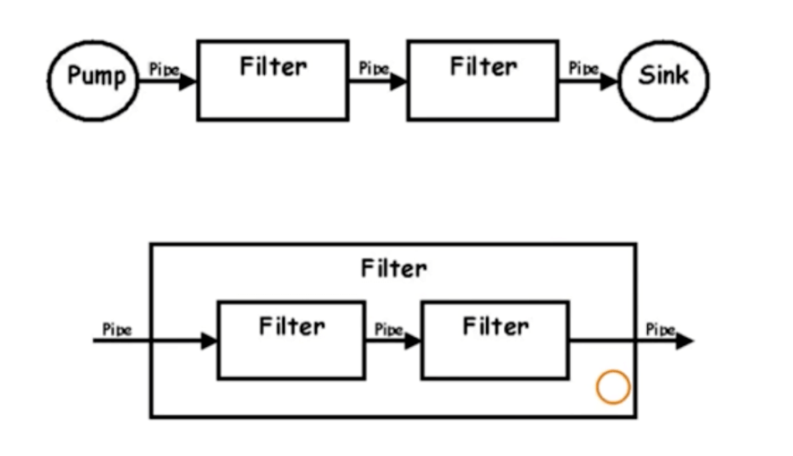

Pipe-Filter架构图如下：

特点：  
- 非常适合数据处理及数据分析系统
- Filter封装数据处理的功能
- 松耦合。Filter只跟数据（格式）耦合
- Pipe用于连接Filter传递数据或者在异步处理过程中缓冲数据流。进程内同步调用时，pipe演变为数据在方法调用中传递。golang中，filter分别获去数据，如pipe实现为channel，则filter接收channel的数据

可以把多个filter组合成一个大filter。

Demo的架构图：

对数据进行转化，变成另一种数据。阿里云的 [日志服务数据加工](https://help.aliyun.com/document_detail/125384.html) 做的也是这类

参考：https://time.geekbang.org/course/detail/100024001-88542

