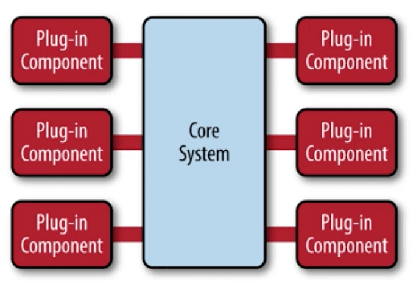

微内核，以插件的方式提供内核外的其他功能，架构图如下：

特点：  
- 易于扩展
- 错误隔离
- 保持架构一致性。不会因为功能变更，内核部分大调整

要点：
- 内核包含公共流程或通用逻辑
- 将可变或可扩展部分规划为扩展点
- 抽象扩展点行为，定义接口
- 利用插件进行扩展

参考：https://time.geekbang.org/course/detail/100024001-88543

